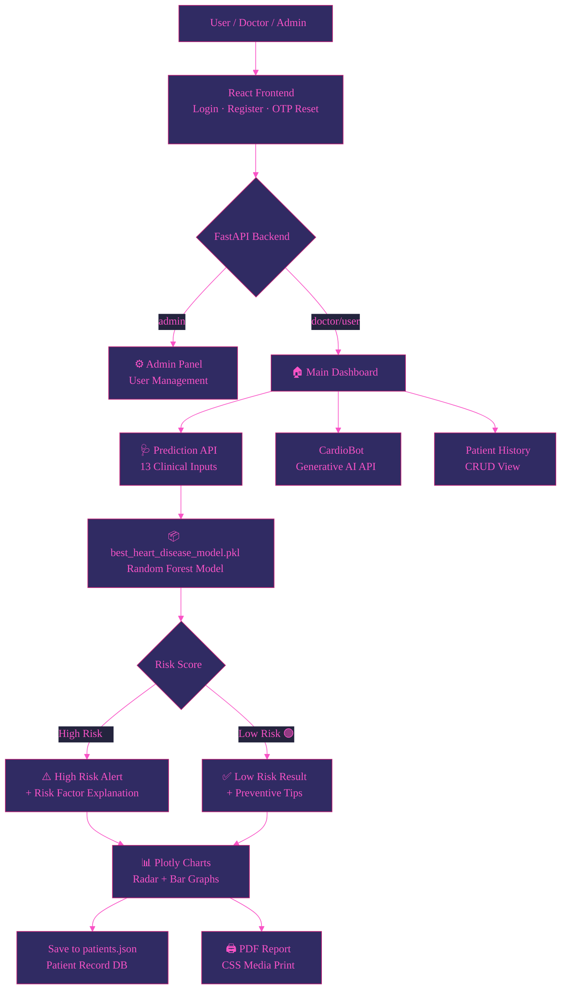
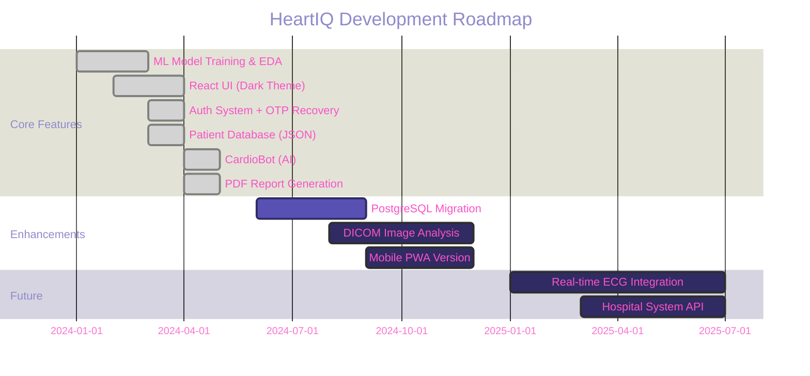

<!-- ═══════════════════════════ ANIMATED HEADER ═══════════════════════════ -->
<div align="center">


<!-- ═══════════ TYPING ANIMATION ═══════════ -->
[](https://git.io/typing-svg)

<br/>

<!-- ═══════════ PRIMARY BADGES ═══════════ -->
[](https://heartiqai.vercel.app/)

<br/>

<!-- ═══════════ TECH BADGES ═══════════ -->

&nbsp;

&nbsp;

&nbsp;

&nbsp;

&nbsp;


<br/>

<!-- ═══════════ STATS BADGES ═══════════ -->

&nbsp;

&nbsp;

&nbsp;

&nbsp;


</div>

---

## 🫀 What is HeartIQ?

**HeartIQ** is a full-stack, production-grade **AI-powered cardiac health intelligence platform** built as a final-year engineering project. It predicts a patient's risk of heart disease by analyzing clinical parameters using an ensemble machine learning model — and wraps everything in a premium, glassmorphism-styled React web app powered by a fast Python backend.

Beyond simple predictions, HeartIQ is a **complete healthcare analytics suite**: it explains risk factors interactively, stores patient histories, allows PDF report generation, and features **CardioBot** — an embedded AI health assistant.

> *"Early detection saves lives. HeartIQ puts the power of clinical AI into every doctor's hands."*

### 🎯 Who is it for?
| User | Use Case |
|------|----------|
| 👨‍⚕️ **Doctors / Clinicians** | Rapid triage, patient history management, PDF report generation |
| 🧑‍💻 **ML Researchers** | End-to-end pipeline: EDA → Model Training → Deployment |
| 🎓 **Students / Educators** | Full capstone project with real-world data & production UI |
| 🏥 **Healthcare Startups** | Ready-to-extend base for cardiac AI products |

---

## ✨ Features at a Glance

<div align="center">

| # | Feature | Description |
|---|---------|-------------|
| 1 | 🧠 **ML Risk Prediction** | Ensemble model predicts `High Risk` / `Low Risk` from 13 clinical inputs |
| 2 | 🤖 **CardioBot AI** | Embedded chatbot for real-time health guidance |
| 3 | 📊 **Interactive Charts** | Plotly radar charts, bar graphs & risk-factor breakdowns |
| 4 | 🔐 **Role-Based Auth** | Three roles: `admin`, `doctor`, `user` — with separate access controls |
| 5 | 📧 **SMTP/SSL OTP** | Secure password reset via Gmail App Password OTP (5-min expiry) |
| 6 | 👥 **Patient Database** | Full CRUD — save, view, and load historical patient records |
| 7 | 🖨️ **PDF Reports** | One-click browser print with CSS media print styles for clean PDFs |
| 8 | 📍 **Modern Stack** | React (Vite) frontend + FastAPI Python backend |
| 9 | 🌗 **Dark Glassmorphism UI** | Deep purple gradient with `backdrop-filter: blur()` cards |
| 10 | 🧬 **Clinical Explanations** | Per-prediction textual explanation of top risk drivers |
| 11 | 📂 **JSON Persistence** | Patient & user records stored in local `patients.json` / `users.json` |

</div>

---

## 🛠️ Technology Stack

<div align="center">

### 🧠 Machine Learning & AI


### 🌐 Frontend & Visualization


### ⚙️ Backend & Security


### 🚀 Deployment


</div>

---

## 🗂️ Project Structure

```
📦 HeartIQ-4th-year-project/
│
├── 📁 frontend/                 ← React (Vite) Application
│   ├── 📁 src/
│   │   ├── 📁 views/            ← Dashboard, Login, Patients, Predict, Admin
│   │   └── 🎨 index.css         ← Global CSS (Glassmorphism dark theme)
│   └── 📄 package.json          ← Frontend dependencies
│
├── 📁 backend/                  ← FastAPI Server
│   ├── 🐍 api.py                ← Main REST API routes
│   ├── 🐍 config.py             ← Environment configurations
│   └── 🐍 helpers.py            ← Utility functions
│
├── 📁 model/                    ← ML Pipeline & Assets
│   ├── 📓 train_model.ipynb     ← Full ML training notebook
│   ├── 🐍 train_models.py       ← Python script for model training
│   ├── 📦 best_heart_disease_model.pkl ← Pre-trained Random Forest model
│   └── 📦 scaler.pkl            ← Pre-fitted StandardScaler
│
├── 📁 data/
│   ├── 📊 heart_disease_data.csv ← Cleveland Heart Disease Dataset
│   ├── 👤 patients.json         ← Runtime patient record store
│   └── 🔑 users.json            ← User accounts (roles: admin/doctor/user)
├── 📋 requirements.txt          ← Backend dependencies
└── 📄 README.md                 ← Project documentation
```

---

## ⚙️ System Architecture



---

## 🧠 Machine Learning Pipeline

### Training Notebook (`model.ipynb`)

The full ML lifecycle is documented in the Jupyter Notebook:

```
1. Data Collection        → Cleveland Heart Disease Dataset (UCI)
2. Exploratory Data Analysis → Correlation heatmaps, feature distributions
3. Data Preprocessing     → Normalization, encoding, train/test split (80/20)
4. Feature Engineering    → 13 key cardiovascular indicators selected
5. Model Training         → Evaluated Logistic Regression, KNN, Decision Tree, Random Forest
6. Evaluation             → Accuracy, Precision, Recall, F1-Score
7. Model Serialization    → joblib.dump() → best_heart_disease_model.pkl & scaler.pkl
8. Deployment             → Loaded at runtime via joblib.load()
```

### 📋 Input Features (13 Clinical Parameters)

| # | Feature | Description | Type |
|---|---------|-------------|------|
| 1 | **Age** | Patient age in years | Numeric |
| 2 | **Sex** | Biological sex (0=Female, 1=Male) | Binary |
| 3 | **Chest Pain Type** | 4 categories: typical/atypical angina, non-anginal, asymptomatic | Categorical |
| 4 | **Resting Blood Pressure** | mmHg on admission | Numeric |
| 5 | **Serum Cholesterol** | mg/dl | Numeric |
| 6 | **Fasting Blood Sugar** | > 120 mg/dl = 1, else 0 | Binary |
| 7 | **Resting ECG Results** | 0=Normal, 1=ST-T abnormality, 2=LV hypertrophy | Categorical |
| 8 | **Max Heart Rate Achieved** | Beats per minute | Numeric |
| 9 | **Exercise Induced Angina** | 1=Yes, 0=No | Binary |
| 10 | **ST Depression** | Induced by exercise relative to rest | Numeric |
| 11 | **Slope of ST Segment** | 0=Upsloping, 1=Flat, 2=Downsloping | Categorical |
| 12 | **Major Vessels (0–3)** | Fluoroscopically colored vessels | Numeric |
| 13 | **Thal** | 1=Normal, 2=Fixed defect, 3=Reversible defect | Categorical |

### 🎯 Output
```
Prediction: HIGH RISK ❤️‍🔥  →  Probability Score + Risk Factor Analysis
Prediction: LOW RISK  ✅     →  Healthy Indicators + Preventive Recommendations
```

---

## 🔐 Authentication System

HeartIQ features a multi-tier authentication system:

```
┌───────────────────────────────────────────────────────┐
│               AUTHENTICATION FLOW                      │
│                                                        │
│  ┌──────────┐    ┌──────────────┐    ┌─────────────┐  │
│  │  Sign In  │    │ Create Acct  │    │ Forgot Pwd  │  │
│  └────┬─────┘    └──────┬───────┘    └──────┬──────┘  │
│       │                 │                    │          │
│  Username +        Register new          Enter email   │
│  Password          user (user role)      → OTP via     │
│  validation        stored in              SMTP/SSL     │
│       │           users.json              Gmail        │
│       ▼                 │            (5-min expiry)    │
│  ┌─────────┐            │                    │          │
│  │  Role   │            │              Verify OTP →   │
│  │ Check   │            │              Reset Pwd       │
│  └────┬────┘            │                              │
│  admin│doctor│user      │                              │
│       ▼                 ▼                              │
│   Dashboard        Dashboard                           │
└───────────────────────────────────────────────────────┘
```

## 🤖 CardioBot — AI Health Companion

CardioBot is an **embedded conversational AI**, designed to provide instant, context-aware cardiac health guidance within the app.

```
User: "My cholesterol is 260 mg/dl. Should I be worried?"

CardioBot: "A cholesterol level of 260 mg/dl is considered 
            high (desirable is below 200 mg/dl). This increases 
            your risk of cardiovascular disease. I'd recommend 
            consulting your cardiologist for a lipid panel and 
            discussing dietary changes and possible medication..."
```

### CardioBot Capabilities
- 💬 Natural language Q&A about heart health metrics
- 🩺 Explains prediction results in plain English
- 💊 Medication & lifestyle guidance (non-prescriptive)
- 📖 References clinical definitions for each input parameter
- 🚨 Flags urgent symptoms requiring immediate medical attention

---

## 📊 Dashboard & Visualizations

The interactive analytics dashboard includes:

```
┌─────────────────────────────────────────────────────────┐
│  ❤️ HEART-IQ                              [Nav Bar]      │
│  Predict | History | About | CardioBot                   │
├────────────────────────┬────────────────────────────────┤
│                        │                                 │
│   🩺 PREDICTION        │  📊 RISK ANALYSIS               │
│                        │                                 │
│  Age:        [  58   ] │  ┌──── Radar Chart ────┐       │
│  Sex:        [  Male ] │  │  BP ●   Chol ●      │       │
│  Chest Pain: [   3   ] │  │    ╲   ╱            │       │
│  ...                   │  │     ╲ ╱             │       │
│                        │  │      ●              │       │
│  [🔍 Predict Risk]     │  └─────────────────────┘       │
│                        │                                 │
│  ┌── RESULT ─────────┐ │  ┌── TOP RISK FACTORS ──┐     │
│  │  ⚠️ HIGH RISK     │ │  │  1. ST Depression    │     │
│  │  Score: 87%       │ │  │  2. Chest Pain Type  │     │
│  └───────────────────┘ │  │  3. Max Heart Rate   │     │
│                        │  └──────────────────────┘     │
└────────────────────────┴────────────────────────────────┘
```

### Chart Types
| Chart | Purpose |
|-------|---------|
| 📡 **Radar Chart** | Multi-dimensional risk factor visualization |
| 📊 **Bar Graph** | Feature contribution to prediction score |
| 📈 **Trend Lines** | Historical patient risk over time |
| 🎯 **Gauge Meter** | Real-time risk percentage display |

---

## 📋 Patient Database Management

The built-in patient record system provides full CRUD functionality:

```json
{
  "name": "John Doe",
  "age": 58, "sex": "Male",
  "result": "HIGH",
  "risk_pct": 87,
  "date": "2024-06-15 14:32:11",
  "saved_by": "doctor",
  "inputs": {
      "cp": 3, "trestbps": 145, "chol": 280, 
      "fbs": 1, "restecg": 0, "thalach": 148, 
      "exang": 0, "oldpeak": 2.3, "slope": 0, 
      "ca": 0, "thal": 2
  }
}
```

**Features:**
- 💾 Auto-save predictions to patient history
- 🔎 Search patients by name or ID
- 📋 One-click load of past records into prediction form
- 🖨️ Generate PDF reports for any saved record
- 🗑️ Admin-only: delete patient records

---

## 🖨️ PDF Report Generation

HeartIQ generates professional, print-ready clinical reports directly from the browser window using CSS print media queries.

```
┌─────────────────────────────────────────────────────┐
│               ❤️  HEART-IQ REPORT                    │
│          Generated: June 15, 2024 — 14:32            │
│─────────────────────────────────────────────────────│
│  Patient: John Doe         Age: 58       Sex: Male  │
│─────────────────────────────────────────────────────│
│  CLINICAL PARAMETERS                                 │
│  • Blood Pressure: 145 mmHg (Elevated)              │
│  • Cholesterol:    280 mg/dl (High)                 │
│  • Max Heart Rate: 148 bpm                          │
│  • ST Depression:  2.3 (Significant)                │
│─────────────────────────────────────────────────────│
│  ⚠️  PREDICTION: HIGH RISK (87% Probability)         │
│─────────────────────────────────────────────────────│
│  TOP RISK FACTORS                                    │
│  1. High ST Depression (2.3)                        │
│  2. Asymptomatic Chest Pain (Type 3)                │
│  3. Elevated Cholesterol (280 mg/dl)                │
│─────────────────────────────────────────────────────│
│  * This report is for clinical reference only.       │
│    Consult a qualified cardiologist.                 │
└─────────────────────────────────────────────────────┘
```

---

## 📦 Dataset Information

| Property | Detail |
|----------|--------|
| 📁 **File** | `heart_disease_data.csv` |
| 🏛️ **Source** | Cleveland Heart Disease Dataset (UCI ML Repository) |
| 📏 **Size** | ~900 patient records, 14 attributes |
| 🎯 **Target** | Binary classification (0=No Disease, 1=Disease) |
| ⚖️ **Balance** | ~45% positive (disease), ~55% negative (healthy) |
| 🗓️ **Origin** | Robert Detrano, M.D., Ph.D. — Cleveland Clinic Foundation |

---

## 🚦 Quick Start

### Prerequisites

```bash
Node.js 18+ (for frontend)
Python 3.9+ (for backend)
```

### 1. Clone the Repository

```bash
git clone https://github.com/Umangpandey75/HeartIQ-4th-year-project.git
cd HeartIQ-4th-year-project
```

### 2. Configure Environment Variables

Create a `.env` file in the root of the project with the following properties:

```env
SMTP_SENDER_EMAIL=your_email@gmail.com
SMTP_SENDER_PASSWORD=your_app_password
GROQ_API_KEY=your_api_key
```

### 3. Backend Setup (FastAPI)

```bash
# Create and activate virtual environment (optional but recommended)
python -m venv venv
# On Windows:
venv\Scripts\activate
# On Mac/Linux:
# source venv/bin/activate

# Install dependencies
pip install -r requirements.txt

# Run the API server
python -m uvicorn backend.api:app --host 127.0.0.1 --port 8000
```
> The API will now be running at `http://localhost:8000`.

### 4. Frontend Setup (React + Vite)

Open a new terminal window:

```bash
cd frontend

# Install Node dependencies
npm install

# Start the Vite development server
npm run dev
```
> The web application will now be running at `http://localhost:5173`. 
> Default login — **Username:** `demo` | **Password:** `demo`

---

## ☁️ Deployment

Deploying HeartIQ is simple using modern cloud platforms:

1. **Backend (Render / Railway)**: Deploy the root folder as a Python web service running the command `uvicorn backend.api:app --host 0.0.0.0 --port $PORT`. Make sure to add your `.env` variables to the dashboard.
2. **Frontend (Vercel / Netlify)**: Deploy the `frontend` folder as a standard Vite application using the build command `npm run build`. Add `VITE_API_URL` to your Vercel environment variables pointing to your new Render backend URL!

🌐 **Live App Demo:** [https://heartiqai.vercel.app/](https://heartiqai.vercel.app/)

---

## 🔬 Model Performance

During the model evaluation phase, multiple algorithms were tested on the dataset. The **Random Forest** classifier achieved the highest predictive performance.

| Algorithm | Accuracy |
|-----------|----------|
| **Random Forest** | **98.54%** |
| Decision Tree | 98.54% |
| K-Nearest Neighbors (KNN) | 83.41% |
| Logistic Regression | 79.51% |

### Best Model Metrics (Random Forest)
| Metric | Score |
|--------|-------|
| ✅ **Accuracy** | 98.54% |
| 🎯 **Precision** | 98.50% |
| 📡 **Recall** | 98.50% |
| 🏆 **F1 Score** | 98.50% |

> 📓 Full evaluation metrics and code are available in [`model/train_models.py`](model/train_models.py) and [`model/train_model.ipynb`](model/train_model.ipynb).

---

## 🗺️ Project Roadmap



---

## 🤝 Contributing

Contributions make open source amazing! Here's how:

```bash
# 1. Fork the repository

# 2. Create your feature branch
git checkout -b feature/YourFeatureName

# 3. Make your changes and commit
git add .
git commit -m "✨ Add: YourFeatureName"

# 4. Push to GitHub
git push origin feature/YourFeatureName

# 5. Open a Pull Request on GitHub 🎉
```

### 💡 Areas to Contribute
- [ ] 🗄️ Replace JSON storage with SQLite / PostgreSQL
- [ ] 📱 Responsive mobile layout
- [ ] 🌍 Multi-language support (Hindi, regional languages)
- [ ] 🧬 Add more ML models (XGBoost, LightGBM comparison)
- [ ] 📡 Real-time ECG data integration (wearables)
- [ ] 🔒 JWT-based session tokens (replace session state)
- [ ] 🧪 Unit tests with `pytest`
- [ ] 🐳 Docker containerization

---

## 📜 License

Distributed under the **MIT License**. See [`LICENSE`](LICENSE) for more information.

---

## ⚠️ Medical Disclaimer

> **HeartIQ is an academic project built for educational and research purposes only.**
> It is NOT a certified medical device and should NOT be used as a substitute for professional medical diagnosis or treatment. Always consult a qualified cardiologist for cardiac health decisions.

---

## 👨‍💻 Author

<div align="center">

### **Umang Pandey**
*B.Tech CSE — NITRA Technical Campus, Ghaziabad*
*Python Developer · Data Analyst · ML Engineer*

[](mailto:umangpandey.co@gmail.com)
&nbsp;
[](https://linkedin.com/in/umang-pandey-01b486273)
&nbsp;
[](https://github.com/Umangpandey75)
&nbsp;
[](https://umangpandey.vercel.app)

*"Query the data. Build the insight. Ship the WOW. ✨"*

</div>

---

## ⭐ Show Your Support

If HeartIQ helped you or impressed you, please give it a star — it motivates further development!

<div align="center">

[](https://github.com/Umangpandey75/HeartIQ-4th-year-project/stargazers)
&nbsp;
[](https://github.com/Umangpandey75/HeartIQ-4th-year-project/fork)
&nbsp;
[](https://heartiqai.vercel.app/)

</div>

---

<!-- ═══════════════════════ FOOTER WAVE ═══════════════════════ -->


<div align="center">

*Made with ❤️ & Python by [Umang Pandey](https://github.com/Umangpandey75) · 4th Year Capstone Project · © 2024–2026*


</div>
